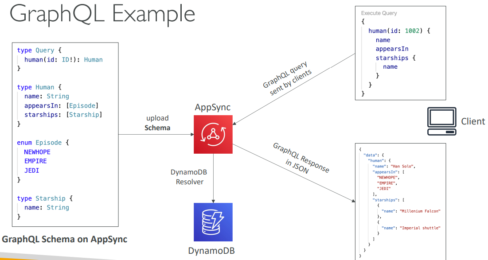

# CloudFront

### Origin Request Policy

The Origin Request Policy in Amazon CloudFront is used to control the information that’s included in an origin request. When a viewer request to CloudFront results in a cache miss (the requested object is not cached at the edge location), CloudFront sends a request to the origin to retrieve the object, this is called an origin request (AWS, 2023a).

The origin request always includes the URL path, the request body (if there is one), and certain HTTP headers (AWS, 2023a):

* The URL path (the path only, without URL query strings or the domain name)
* The request body (if there is one)
* The HTTP headers that CloudFront automatically includes in every origin request, including `Host`, `User-Agent`, and `X-Amz-Cf-Id`

:warning:Other information from the viewer request, such as URL query strings, HTTP headers, and cookies, is not included in the origin request by default.&#x20;

To pass other information from the request, such as URL query string, cookies, etc., the "origin request policy" can be used to control the information that is included in an origin request.

**Example Console Config**

<figure><figcaption>
MAAREK, 2023
</figcaption></figure>

### CloudFront - Origins

* S3 Buckets
  * For distributing files and caching them at the edge.
  * Enhanced security with CloudFront Origin Access Control (OAC).
  * OAC is replacing Origin Access identity (OAI).
  * CloudFront can be used as an ingress (to upload files to S3).
* Custom Origin (HTTP)
  * Application Load Balancer.
  * EC2 instance.
  * S3 websiter (must first enable the bucket as a static s3 website).
  * Any HTTP backend you want.

### CloudFront High Level Diagram

<figure><figcaption></figcaption></figure>

### CloudFront - S3 as an Origin

<figure><figcaption></figcaption></figure>

### CloudFront vs S3 Cross Region Replication

* CloudFront:
  * Global Edge Network.
  * Files are cached for a TTL.
  * :warning: **Great for static content that must be available everywhere.**
* S3 Cross Region Replication:
  * Must be setup for each region you want replication to happen.
    * **VS CloudFront:** Amazon CloudFront does not provide fine-grained control over which specific edge locations cache your content. **When you configure CloudFront, your content is cached across multiple edge locations globally to improve latency and availability for your users**.
  * Files are updated in near real-time.
  * ReadOnly.
  * :warning: **Great for dynamic contend that needs to be available at low-latency in few regions.**

### Signed URLs&#x20;

#### Proccess for Creating and Using Signed URLs

How signed URLs work with CloudFront and Amazon S3 (AWS, 2023b):

1. **Configuration**: To set up signed URLs, you configure your CloudFront distribution by specifying trusted key groups that contain public keys. These keys are used to verify the signature of the URLs. You use corresponding private keys to sign the URLs.
2. **Developing the Application**: Your application is responsible for determining whether a user should have access to certain content and for creating signed URLs for restricted content. There are two methods for creating signed URLs: using a canned policy or a custom policy.
3. **User Request**: When a user wants to access a file that requires a signed URL, your application verifies the user's entitlement to access it, such as by checking if they've signed in, paid for access, or met other requirements.
4. **Generating Signed URLs**: After verification, your application generates and provides the user with a signed URL, allowing them to download or stream the content. This step is usually seamless for the user, especially when accessing content through a web browser.
5. **Signature Validation**: CloudFront uses the public key to validate the URL's signature, ensuring it hasn't been tampered with. If the signature is invalid, the request is rejected.
6. **Policy Confirmation**: If the signature is valid, CloudFront checks the policy statement in the URL (or constructs one for canned policies) to confirm if the request aligns with the specified access parameters, such as time restrictions.
7. **Content Delivery**: If the request meets the policy requirements, CloudFront proceeds with standard operations. It checks if the file is in the edge cache, forwards the request to the origin if needed, and delivers the file to the user.

### CloudFront Geo Restriction

* You can restrict who can access your distribution.
  * Allowlist and Blocklist.
* The "country" in determined using a 3 party Geo-IP database.
* Use Case: Copyright Laws to control access to contend.

.png>)

### References

AWS. _Controlling origin requests_. Amazon Web Services. Disponível em: <[https://docs.aws.amazon.com/AmazonCloudFront/latest/DeveloperGuide/controlling-origin-requests.html](https://docs.aws.amazon.com/AmazonCloudFront/latest/DeveloperGuide/controlling-origin-requests.html)>. Acesso em: 22 set. 2023a.
