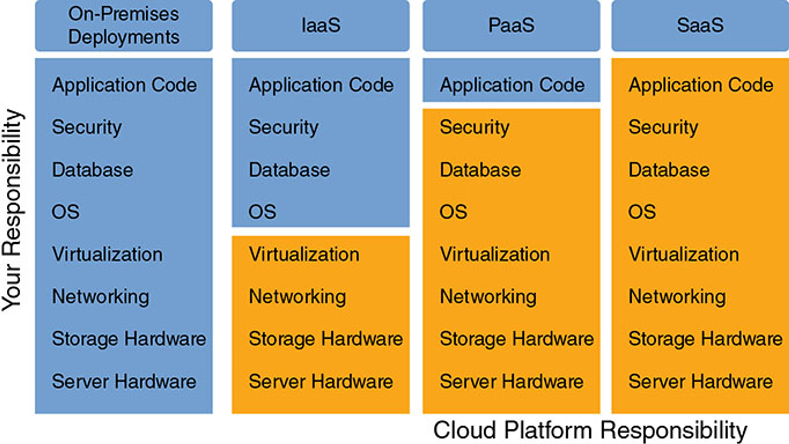

# Elastic Beanstalk

* Elastic Beanstalk is a developer centric view of deploying an application on AWS.
* It uses all the component’s we’ve seen before: EC2, ASG, ELB, RDS.
* It is a Managed service:
  * Automatically handles capacity provisioning, load balancing, scaling, application health monitoring, instance configuration, …
  * :warning: Just the **application code** is the **responsibility of the developer**.
* We still have full control over the configuration.
* Beanstalk is free but **you pay for the underlying instances**.

### Elastic Beanstalk - Components

* Application:
* Application Version:
* Environment:
  * Collection of AWS resources running an application version (only one app version at a time).
  * Tiers:&#x20;
  * Web Server Environment Tier: This tier is designed to support web applications that handle HTTP(S) requests. It provisions resources to accommodate your web application
  * Worker Environment Tier: This tier is used for applications that need to handle background-processing tasks. This tier do not run web server processes.
    * [This tier can be used to offload long-running processes from your web tier. The tiers communicate with each other via SQS. When your web instance needs to spawn a background job, it posts a message to the shared queue with the job details](https://stackoverflow.com/questions/43302799/what-are-the-difference-between-worker-tier-and-web-tier-in-aws-beanstalk).

<figure><figcaption></figcaption></figure>

### Elastic Beanstalk  Supported Platforms

* Go, Java SE, Java with Tomcat, .NET Core on Linux, .NET on Windows Server, Node.js, PHP, Python, Ruby, Packer Builder, Single Container Docker, Multi-Container Docker, Preconfigured Docker.
* If not supported, you can write your custom platform (advanced).

### Elastic Beanstalk - Deployment Modes

<figure><figcaption></figcaption></figure>

#### Elastic Beanstalk - Deployment Options for Updates

* All at once (deploy all in one go) – fastest, but instances aren’t available to serve traffic for a bit (downtime).
* Rolling: update a few instances at a time (bucket), and then move onto the next bucket once the first bucket is healthy.
* Rolling with additional batches: like rolling, but spins up new instances to move the batch (so that the old application is still available).
* Immutable: spins up new instances in a new ASG, deploys version to these instances, and then swaps all the instances when everything is healthy.
*   Blue Green: create a new environment and switch over when read.

    * Note: Not a “direct feature” of Elastic Beanstalk.
    * Create a new “stage” environment and deploy v2 there
    * :warning: Route 53 can be setup using weighted policies to redirect a little bit of traffic to the stage environment.
    * Using Beanstalk, “swap URLs” when done with the environment test.

    <figure><figcaption></figcaption></figure>
* Traffic Splitting: canary testing – send a small % of traffic to new deployment.

The following table compares deployment method properties:

<figure><figcaption>
Font: AWS, 2023a
</figcaption></figure>

### Elastic Beanstalk CLI

We can install an additional CLI called the “EB cli” which makes working with Beanstalk from the CLI easier.

* Basic commands are:
  * eb create
  * eb status
  * eb health
  * eb events
  * eb logs
  * eb open
  * eb deploy
  * eb config
  * eb terminate

### Elastic Beanstalk - Lifecycle Policy

* Elastic Beanstalk can store at most 1000 application versions.
* If you don’t remove old versions, you won’t be able to deploy anymore.
* To phase out old application versions, use a lifecycle policy:
  * Based on time (old versions are removed).
  * Based on space (when you have too many versions).
* Versions that are currently used won’t be deleted.
* Option not to delete the source bundle in S3 to prevent data loss.

### Elastic Beanstalk -  Extensions

* A zip file containing our code must be deployed to Elastic Beanstalk.
* All the parameters set in the UI can be configured with code using files.
* Requirements:
  * in the `.ebextensions/` directory in the root of source code.
  * YAML / JSON format
  * `.config` extensions (example: logging.config).
  * Able to modify some default settigs using: option\_settings.
  * ability to add resources such as RDS, ElastiCache, DynamoDB, etc...
* :warning: Note: Resources managed by `.ebextensions` get deleted if the environment goes away.
* :warning: Note: you can define CloudFormation resources in your .ebextensions to provision ElastiCache, an S3 bucket, etc.

### Elastic Beanstalk -  Migration Load Balancer Type

* After creating an Elastic Beanstalk environment, you cannot change the Elastic Load Balancer type (only the configuration).
* To migrate:
  * create a new environment with the same configuration except LB (can’t clone).
  * deploy your application onto the new environment.
  * perform a CNAME swap or Route 53 update.

<figure><figcaption></figcaption></figure>

### Elastic Beanstalk -  RDS

* RDS can be provisioned with Beanstalk, which is great for dev / test.
* This is not great for prod as the database lifecycle is tied to the Beanstalk environment lifecycle.
* The best for prod is to separately create an RDS database and provide our EB application with the connection string.

<figure><figcaption></figcaption></figure>

#### Elastic Beanstalk -  Migration RDS

* Create a snapshot of RDS DB (as a safeguard).
* Go to the RDS console and protect the RDS database from deletion.
* Create a new Elastic Beanstalk environment, without RDS, point your application to existing RDS.
* perform a CNAME swap (blue/green) or Route 53 update, confirm working.
* Terminate the old environment (RDS won’t be deleted).
* Delete CloudFormation stack (in DELETE\_FAILED state).

<figure><figcaption></figcaption></figure>

### TODO

* 2x Elastic Beanstalk application:
  * One Web Elastic Beanstalk Application.
  * One Worker Elastic Beanstalk Application.
  * Communication using SQS.&#x20;
* Load balancing (try creating a standalone ALB that sends requests to the Elastic Beanstalk application). Try not to create an ALB that is coupled with EB.
* RDS.

### References

AWS. _Deploying applications to Elastic Beanstalk environments_. Amazon Web Services. Disponível em: <[https://docs.aws.amazon.com/elasticbeanstalk/latest/dg/using-features.deploy-existing-version.html](https://docs.aws.amazon.com/elasticbeanstalk/latest/dg/using-features.deploy-existing-version.html)>. Acesso em: 30 set. 2023a.

