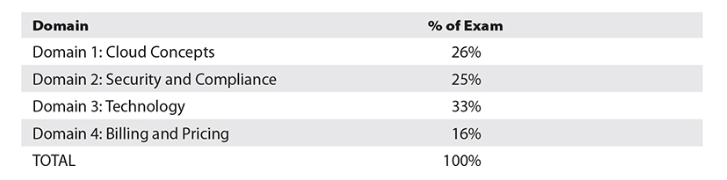
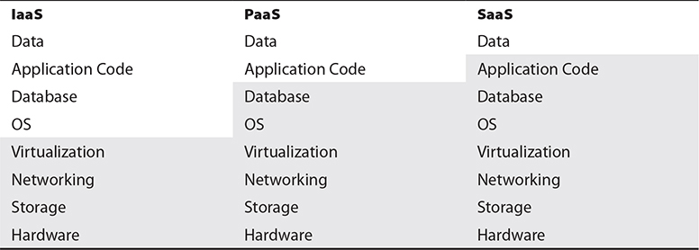
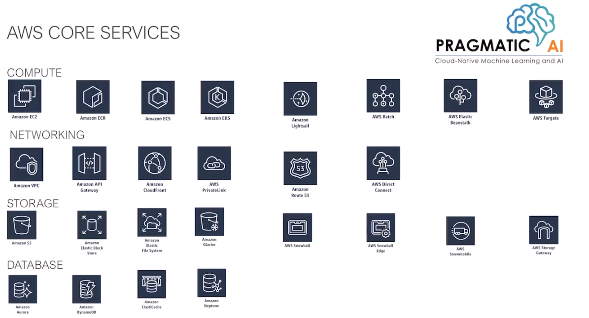

# Notes of AWS Certified Cloud Practitioner All-in-One Exam Guide (Exam CLF-C01)
By Daniel Carter

## 1. Becoming An AWS Certified Cloud Practitioner
In order to pass the AWS CCP Exam, a candidate will be expected to demonstrate the following:
- Explain the value of AWS Cloud services
- Understand and be able to explain the AWS Shared Responsibility Model
- Understand and be able to explain security best practices for **AWS accounts** and **management consoles**
- Understand how pricing, costs, and budgets are done within AWS, including the tools that AWS provides for monitoring and tracking them
- Be able to describe the core and popular AWS service offerings (storage, daabases, compute, network and development)
- Be able to recommend and justify which AWS core services would apply to real-world scenarios

---

### About the AWS CCP Exam
- AWS CCP consists of 65 questions with a 90-minute exam time limit.
- The exam consists of two types of questions
    - Multiple choice: Each question has four possible answers, only one of which is correct.
    - Multiple response: Each question has five or more possible answers, two or more of which are correct
    - Unscored content
    - Any unanswered question is scored by the exam as incorrect.
- In order to pass the exam, you neet to score of 700.

### AWS CCP Domain
- The exam is divided into **four different domains**


- The number of questions of each section will generally follow the weighted distribution of content for the exam, so you will get more questions from some sections and fewer than others to reflect this.

- Domain 1 - Cloud Concepts
  - It will introduce you to the AWS and the value it can bring to your organization
- Domain 2 - Security and Compliance
  - It focuses on how security is a primary focus for AWS across all services
- Domain 3 - Technology
  - It convers the technical aspects of the AWS Cloud. This includes the tools and utilities to get users up and running in AWS, as well as code development.
- Domain 4 - Billing and Pricing
  - It covers the many different pricing models that AWS offers across all their services, focusing on the unifying fact that costs are only incurred for resources that are provisioned and only while they are being used.

## 2. Cloud Concepts
In this chapter the following topics are discussed:
- Define the AWS Cloud and its value proposition
- Identity aspects of AWS Cloud Economics
- List the different cloud architecture design principles

---

### What is Cloud Computing?

The NIST Definition of Cloud Computing - NIST SP 800-145

> Cloud computing is **a model for enabling** ubiquitous, convenient, on-demand network **access to a shared pool of configurable computer resources** (e.g., networks, servers, storage, applications, and services) that can be rapidly provisioned and released with minimal management effort or service provider interaction. This cloud model is composed of five essential characteristics, three service models, and four deployment models.

### Computing Cloud Computing Concepts
- Cloud Application is an application that does not reside or run on a user's device, but rather is accessible via network (ISO/IEC 17788)
- Cloud application portability is the ability to migrate a cloud application from one cloud provider to another (ISO/IEC 17788)
- Cloud computing is a kind of network-accessible platform that delivers services from a large and scalable pool of systems, rather than dedicated physical hardware and more static configurations (ISO/IEC 17788)
- Cloud data portability is the ability to move data between cloud providers (ISO/IEC 17788)
- Cloud deployment model is how cloud computing is deliveryd through a set of particular cofigurations and features of virtual resources. The cloud deployment models are **public, private, hybrid and community** (ISO/IEC 17788)
- Multitenancy is the situation where multiple customers and applications running within the same environment but in a way that they are isolated from each other and not visible to each other but share the same resources (ISO/IEC 17788)
- **Cloud service customer** is the one that holds a business relationship for services with a cloud service provider (ISO/IEC 17788)
- **Cloud service user** is the one that interacts with and consumes services offered by a cloud services customer (ISO/IEC 17788)

### Key Cloud Computing Characteristics
1. On-demand self-service
    - Cloud services can be requested, provisioned, and put into use by the customer through automated means without the need to interact with a person.
2. Broad network access
    - All cloud services and components are accessible over the network and accessible in most cases through many different vectors.
3. Resource pooling
4. Rapid elasticity
   - With cloud computing being decoupled from hardware and with the programmatic provisioning capabilities, services can be rapidly expanded at any time additional resources are needed. 
5. Metered service
    - Depending on the type of service and cloud implementation, resources are metered and logged for billing and utilization reporting. This metering can be done in a variety of ways(storage, network, memory, processing)
6. Multitenancy

### The cloud computing enabler - Virtualization
Virtualization is what makes cloud computing. When a request is made by a cloud customer through an automated web portal or other similar system, resources are automatically allocated to a virtual machine from the large pool of resources.

### Cloud Service Categories
#### IaaS
Infrastructure as a Service (IaaS) is a cloud service category where infrastructure-level services are provided by a cloud service provider (ISO/IEC 17788).

AWS Services:
   - Amazon Elastic Compute Cloud (EC2)
   - Elastic Block Store (EBS)
   - Elastic Load Balancing

The capability provided to the consumer is to **provision processing, storage, networks**, and other fundamental computing resources **where the consumer is able to deploy and run arbitrary software**
    - Customer has no control over the the underlying cloud infrastructure
    - Customer has control over the O.S, storage and deployed applications

Benefits:
- Scalability
- Cost of ownership of physical hardware:  Within IaaS, the customer does not need to procure any hardware
- High availability
- Physical and logical security requirements: the cloud provider assumes the cost and oversight of the physical security of its data centers. Data is also protected by layers of logical network security and user access security
- Location and access independence
- Metered usage
- Choice of hardware

#### PaaS
Platform as a Service (PaaS) is cloud service category where platform services are provided to the cloud customer, and the cloud provider is responsible for the system up to the level of the actual application (ISO/IEC 17788).

AWS Service:
    - Elastic Beanstalk
    - SageMaker

The capability provided to the customer is to **deploy** onto the cloud infrastructure **consumer-created or acquired applications** created using programming languages, libraries, services, and tools supported by the provider
    - Customer has no control over the underlying cloud infra such as network, servers, O.S and storage
    - Customer has control over the deployed applications and configuration settings for the application-hosting environment.

Benefits:
   - Auto-scaling
   - Multiple host environments: With the cloud provider responsible for the actual platform, the **customer has a wide choice of operating systems and environments**. It allows test in different environment
   - Choice of environments
   - Flexibility:  In a traditional data center setting, application **developers are constrained by the offerings of the data center** and are locked into proprietary systems that make relocation or expansion difficult and expensive. With **those layers abstracted in a PaaS model**, the developers have enormous flexibility to move between providers and platforms with ease
   - Ease of Upgrades
   - Cost-effective: only systems that are actively and currently used incur costs
   - Ease Access
   - Licensing: Cloud provider is responsible for handling proper licensing of operating systems and platforms,


```
The underlying infrastructure refers to the hardware and software components that support a cloud computing service. This includes the physical servers, storage devices, networking equipment, and virtualization software that work together to create the cloud environment. In the case of PaaS and IaaS, the underlying infrastructure differs in terms of the level of abstraction that is provided to the user. With IaaS, the user has more control over the infrastructure and is responsible for managing the operating system, middleware, and applications, while with PaaS, the cloud provider manages much of the infrastructure, allowing the user to focus more on developing and deploying applications.
```

```
Which "underlying infrastructure" in IaaS is the user responsible for, and which infrastructure is the cloud provider responsible for?

In an IaaS model, the cloud provider is responsible for the underlying physical infrastructure, including servers, storage, networking, and data center facilities. On the other hand, the user is responsible for managing the operating system, applications, data, and security configurations of the virtual machines or servers provisioned on top of the infrastructure. This means that the cloud provider ensures the availability and scalability of the infrastructure, while the user is responsible for the proper management and security of their applications and data within that infrastructure.
```

```
An application deployed in a PaaS environment can access a database. In a PaaS environment, the cloud provider is responsible for managing the underlying infrastructure and the database, including its configuration, scaling, and maintenance. **However, the user is responsible for managing the data stored in the database**, such as data security and compliance. The user typically interacts with the database through a web-based console or command-line interface provided by the PaaS environment.
```

```
Can an application deployed in a PaaS environment access a database? Who is responsible for controlling the database in a PaaS environment?

Yes, an application deployed in a PaaS environment can access a database. In a PaaS environment, the cloud provider is responsible for managing the underlying infrastructure and the database, including its configuration, scaling, and maintenance. However, the user is responsible for managing the data stored in the database, such as data security and compliance. The user typically interacts with the database through a web-based console or command-line interface provided by the PaaS environment.
```

```
How does a database work in an IaaS environment? Is it the user's responsibility to create the database or is it the responsibility of the cloud provider?

 In an IaaS environment, the user is responsible for creating and managing the database, including installing the database software and configuring it to work with their virtual machines. The cloud provider typically provides the infrastructure necessary for the database to run, such as the physical servers and storage, but the user is responsible for all aspects of database administration, including backups, security, and scaling. In some cases, cloud providers may offer managed database services within their IaaS offering, which can take some of the database management responsibility off of the user's plate.
```

```
Is the AWS service RDS IaaS or PaaS?

Amazon RDS (Relational Database Service) is a managed database service provided by AWS, which falls under the category of PaaS (Platform as a Service). With RDS, AWS manages the underlying infrastructure and database management tasks such as backups, patching, scaling, and replication, while allowing users to focus on their applications and data.

```

```
Is the AWS service ECS IaaS or PaaS?

The AWS service ECS (Elastic Container Service) is a PaaS (Platform as a Service) offering. It provides a managed platform for running and scaling containerized applications.
```

#### SaaS
Software as a Service (SaaS) is a Cloud service category in which a full application is provided to the cloud customer, and the cloud provider maintains responsibility for the entire infrastructure, platform, and application (ISO/IEC 17788).

Known services:
    - Gmail
    - Dropbox
    - iCloud

Benefits:
- Support costs and efforts
- Reduced overall costs 
- Licensing
- Ease of use and administration
- Standardization

### Cloud Deployment Models

#### Public Cloud
NIST SP 800-145 definition:

> The cloud infrastructure is provisioned for open use by the general public. It may be owned, managed, and operated by a business, academic, or government organization, or some combination of them. It exists on the premises of the cloud provider.

#### Private Cloud
NIST SP 800-145 definition:

> The cloud infrastructure is provisioned for exclusive use by a single organization comprising multiple consumers (e.g., business units). It may be owned, managed, and operated by the organization, a third party, or some combination of them, and it may exist on or off premises.

#### Community Cloud
NIST SP 800-145 definition:

> The cloud infrastructure is provisioned for exclusive use by a specific community of consumers from organizations that have shared concerns (e.g., mission, security requirements, policy, and compliance considerations). It may be owned, managed, and operated by one or more of the organizations in the community, a third party, or some combination of them, and may exist on or off premises.

It is comparable to a private cloud with the exception of multiple ownership and/or control versus singular ownership of a private cloud.

#### Hybrid Cloud
NIST SP 800-145 definition:

> The cloud infrastructure is a composition of two or more distinct cloud infrastructures (private, community, or public) that remain unique entities, but are bound together by standardized or proprietary technology that enables data and application portability (e.g., cloud busting for load balancing between clouds).

### The Cost-Benefit Analysis of the different kinds of "Clouds"

#### Resource Pooling and Cyclical Demands
With a traditional data center, an organization has to maintain sufficient resources to handle their highest load peaks, which demands much larger up-front hardware and ongoing support costs. However, organizations might have a cyclical nature to their system demands.

In the case mentioned above, a transition to the cloud would be a benefit, since the up-front cost would be far lower without having to build up a massive infrastructure from the outset.

In cases where a company has a steady load throughout the year and cyclical peak of demands are not a concern for the company, then a move to a cloud environment may not yield the same level of benefits.

#### Data Center Costs vs. Operational Expense Costs
With facilities, utilities systems staff, networking, storage, and all the components needed to run data center operations being the responsibility of the cloud provider, the focus is then shifted to management and oversight, as well as requirements for building and auditing. 

It is important for any organization thinking about moving to a cloud environment to fully assess the staff and talents they already have and whether they can adapt to the new demands and changing roles in a cloud environment.

#### Focus Change
Companies have operations and development staff. By moving to a cloud environment, the operations side will fundamentally change running systems to overseeing them.

A rush to a cloud environment could disrupt productivity; cause internal fighting; or even result in a significant loss of staff. However, a move to a cloud carries enormous benefits such as: 
- Developers can very easily take on new projects and try out new innovations with the ability to rapidly allocate resources
- change in culture as well
- ability to quickly start projects without the traditional wait times and costs for hardware procurement and configuration

#### Ownership and Control
When an organization owns their data centers and all the hardware, they get to set all the rules and have full control over everything.

In a cloud environment, the organization gives up direct control over operational procedures, system management, and maintenance, as well as upgrade plans and environment changes.

Major cloud providers such as AWS have enabled a heightened sense of ownership with the flexibility they offer for configurations and the broad range of options for resources. 
#### Cost Structure
**Costs are very predictable in a traditional data center**. An organization can appropriate funds for capital expenditures for hardware and infrastructure and then allocate appropriate staffing and resources to maintain the hardware and infrastructure over time.

In a cloud environment with metered pricing, costs are realized as resources are added and changed over time.  This can cause an unpredictable schedule of costs.

### Universal Cloud Concepts
- Interoperability: It is the ease with which one can move or reuse components of an application or service
- Elasticity and Scalability
    - They are similar concepts in terms of the **changing of resources allocated** to a system or application to meet current demands
    - **The difference between them relates to the manner in which the level of resources is altered**
    - Scalability the allocated resources are changed statistically to meet anticipated demands or new deployments in services
    - Elasticity adds the ability for the dynamic modification of resources to meet demands as they evolve (customer can set thresholds for when a cloud environment will automatically add or remove resources)
- Performance
- Availability and Resiliency
    - To remember the **difference** between availability and resiliency **is the extent to which a system is affected by outages** 
    - Availability pertains to the overall status if a system is up or down.
    - Resiliency pertains to the ability of a system to continue to function when some aspect or portions of it experience an outage
- Portability: It is the key feature that allows systems to easily and seamlessly move between different cloud providers
- Service Level Agreements (**SLA**): It spells out in clear terms the minimum requirements for uptime, availability, processes, customer service and support, security controls and requirements, auditing, reporting, etc
- Governance: Governance at its core involves assigning jobs, tasks, roles, and responsibilities and ensuring they are satisfactorily performed 

## 3. Security and Complience
In this chapter the following topics are discussed:
- Define the AWS Shared Responsibility Model
- Define AWS Cloud security and compliance concepts
- Identify AWS access management capabilities
- Identity resources for security support

### AWS Shared Responsibility Model
Cloud provider responsabilities:
- facilities
- redundancy
- physical security
- network cabling
- hardware components
- availability zones, edge locations

Beyond the layers of physical facilities and computing hardware, there are differing levels of responsibility based upon the cloud services model employed.


The image above shows the areas of responsibility within a cloud implementation. The shaded areas represent the responsibility on the part of the cloud provider.

> 7.  Which area of responsibility lies with the customer in a PaaS implementation?
>
> A.   Application code
>
> B.   Security
>
> C.   Operating system
>
> D.   Storage
>
> **[A]. The application code is the responsibility of the customer within a PaaS service model.**

#### Manage Resources vs. Unmanaged
1. Managed resources are those where the cloud provider is responsible for the installation, patching, maintenance, and security of a resource.
2. Unmanaged resources are those hosted within a cloud environment, but where the customer bears responsibility for host functions. 

### Data Security Strategies
Several toolsets and technologies are commonly used as data security strategies:
- Encryption
- Hashing
- Key management
- Masking
- Obfuscation
- Anonymization
- Tokenization

### Encryption
The architecture of an encryption system has three basic components: 
- the data itself, 
- the encryption engine that handles all the encryption activities, 
- the encryption keys used in the actual encryption and use of the data.

Encryption aspects to consider:
- the storage of data on a system: 
    - when it is being accessed 
    - when it is at rest
- transmission of data and transactions between systems. 

**Any use of encryption will cause higher load and processing times, so proper scaling and evaluation of systems are critical when testing deployments and design criteria.**


In a cloud environment, ensuring the encryption and security of data-at-rest is crucial because virtual machines are widely used. Unlike in a conventional data center where systems can be powered off and unreachable, in a virtual environment, the underlying image remains in storage even when a system is not powered on or started. This creates a risk of compromise or corruption, particularly if developers have stored application or customer data on the VM image.

As a last major concern, encryption does not ensure data integrity, only confidentiality within an environment.

#### Data in transit (transmission of data)
The most common method for data-in-transit encryption is to use the well-known SSL and TLS technologies under HTTPS. Beyond using HTTPS, other common encryption methods for data in transit are VPNs (virtual private networks) and IPsec. These methods can be used by themselves but are most commonly used in parallel to provide the highest level of protection possible.

#### Data at rest
Data at rest refers to information stored on a system or device (versus data that is actively being transmitted across a network or between systems). Some examples include **databases**, file sets, spreadsheets, documents, tapes, archives, and even mobile devices.

#### Challenges with Encryption
A central challenge to encryption implementations is the dependence on key sets to handle the actual encryption and decryption processes. Without the proper security of encryption keys, or exposure to external parties such as the cloud provider itself, the entire encryption scheme could be rendered vulnerable and insecure.

#### Encryption Implementations
##### Database storage systems
With databases two layers of encryption are typically applied. First, database systems will reside on volume storage systems. The database files can be protected through encryption methods at the volume storage system level.

The second layers is within the database system itself are encryption methods that can be applied to the data set, either wholesale or on a granular level, by encrypting specific tables or columns of data.

### Hashing
Hashing is a process of converting data of any size into a fixed-size output, known as a hash value, hash code, or message digest. This output is typically a unique representation of the original input data and is generated using a hash function.

A hash function takes the input data and performs a set of mathematical operations on it to create a hash value that is usually a fixed size, regardless of the size of the input data. The hash value is generally used as a digital fingerprint of the original input data and is used for several purposes, including **verifying the integrity of data, storing passwords securely, and detecting duplicates**. This process is widely referred to by common terms such as checksums, digests, or fingerprints.

**Hashing is a one-way function, which means that it is not possible to recreate the original input data from the hash value.**

### Key Management
Key management is a critical task that involves protecting encryption keys and controlling access to them. 

With regard to the storage of encryption keys, in a traditional data center configuration, the key management system will typically be on dedicated hardware and systems, segregated from the rest of the environment. Within a cloud environment, due to multitenancy, protection of the virtual machine hosting the key management system is vital.

Key storage can be implemented in a cloud environment in three ways:
1. Internal storage: the keys are stored and accessed within the same virtual machine as the encryption service or engine—it keeps the entire process together, and it is appropriate for some storage types such as database and backup system encryption. 
2. External storage, the keys are maintained separately from the systems and security processes (such as encryption).
3. External and independent service or system host the key storage. 

### Tokenization
Tokenization is the practice of utilizing a random and opaque “token” value in data to replace what otherwise would be a sensitive or protected data object. The token value is usually generated by the application with a means to map it back to the actual real value.

Tokens are not mathematically related to the original data, which makes them more secure against attacks such as brute-force decryption or dictionary attacks. It's worth noting that tokens can still be vulnerable to attacks such as **token guessing**, where an attacker tries to guess valid tokens in order to access sensitive data. 

The relationship between the token and the original data that is maintained through the use of a tokenization system. The **tokenization system generates a unique token** for each piece of sensitive data that needs to be tokenized, **and the token is then stored in a database alongside the original data**.

### Tokenization vs Encryption
```
Encryption and tokenization are both methods used to protect sensitive data, but they operate in different ways.

Encryption is the process of converting data into a coded language that can only be deciphered with a secret key or password. The encrypted data is still the original data, but it's scrambled in a way that makes it unreadable without the key. Encryption is used to protect data both at rest and in transit, such as passwords, credit card numbers, and other sensitive information.

Tokenization, on the other hand, is the process of substituting sensitive data with a non-sensitive equivalent, called a token. The token has no mathematical relationship to the original data, and cannot be reverse-engineered to reveal the original data. Tokenization is commonly used to protect sensitive data in payment processing, where the token replaces the credit card number, for example.

In summary, encryption protects data by scrambling it with a key, while tokenization substitutes the sensitive data with a non-sensitive equivalent.
```

### Data Loss Prevention (DLP)
DLP is a set of controls and practices put in place to ensure that data is only accessible and exposed to those users and systems authorized to have it.

DLP implementation is composed of three common components:

1. **discovery and classification stage**: The focus is on identifying data that is relevant to the DLP strategy, and once the data has been found, it is necessary to determine its security classification and requirements.

2. **monitoring**:  It involves the actual process of watching data as it moves through the various states of usage to ensure it is being used in appropriate and controlled ways. It also ensures that those who access and use the data are authorized to do so and are using it in an appropriate manner.

3. **enforcement DLP policies**: Upon detecting potential violations, the DLP implementation can automatically take a range of measures based on the policies established by management. These measures can include logging and alerting of the violation or actively blocking and preventing it at the point of detection.

#### Cloud environment vs DLP - Challenges
The cloud environment brings additional challenges to DLP. First, data in a cloud is spread across large storage systems, with varying degrees of replication and redundancy, and oftentimes where the data will be stored and accessed is unpredictable. For a DLP strategy, this can pose a particular challenge because it makes properly discovering and monitoring all data used by a system or application more difficult, because the data can change locations over time.

### Data De-identification
Data de-identification involves using **masking**, **obfuscation**, or **anonymization**.

Masking: This strategy involves replacing sensitive data with fictitious data that has the same format as the original data. Masking is often used to protect data during development or testing, and can help ensure that sensitive data is not exposed during these processes.

Obfuscation: This strategy involves intentionally making the data difficult to understand or read, while still maintaining its functionality. Obfuscation is often used in software development to protect intellectual property and prevent reverse engineering.

Anonymization: This strategy involves removing or altering personal identifying information from the data to protect the privacy of individuals. Anonymization is often used in data analysis and research to protect the identities of individuals while still allowing for meaningful analysis of the data.

### AWS Identity and Access Management
#### IAM User Groups and Roles
- **Groups** are used to assign a standard set of permissions to users as they are added to the system.
- **Roles** in AWS are the granular permissions that users can be granted. Within each AWS service, there are multiple roles that allow different activities, such as reading data, creating data, deploying services, provisioning access, etc.

#### Federated Access
With federated access, you can use technologies such as SAML or Microsoft Active Directory to provision users, rather than creating them manually through the IAM account process in the Console. The big advantage with using federated access is that users will use accounts and credentials they already have established to access AWS.

## 4. Technology
In this chapter the following topics are discussed:
- Define methods of deploying and operating in the AWS Cloud
- Define the AWS global infrastructure
- Identify the core AWS services
- Identity resources for technology support

### AWS Developer Tools and SDKs
https://aws.amazon.com/developer/tools/

#### CodeBuild
This AWS's service compile, test code and build deployment packages.

#### CodeCommit
AWS managed service for secure Git repositories.

#### CodeDeploy
AWS CodeDeploy is a managed deployment service that can deploy code fully across AWS services or on-premises servers. 

### System Manager
- Helps you manage your EC2 and On-Premise systems at scale
- Get operational insights about the state of your infrastructure
- Easily detect problems
- **Patching automation for enhanced compliance** (patch manager)
- Integrated with CloudWatch metrics/dashboards
- Integrated with AWS Config
- Resource Groups


####  Patch Manager   
Allows for automatically handling patching of systems across EC2 or on-premises systems through the use of baselines. Patch Manager allows for the scheduling of patching and auditing the status of them.

####  Run command   
Provides a way to run commands on servers within AWS without having to actually access them via SSH or PowerShell. The Run command logs all activities under CloudTrail and allows for granular access control via IAM.

#### Parameter Store
Provides a way to store configuration data for your applications. This can be either plain-text strings or passwords used to access services such as databases. A main benefit of the Parameter Store is the ability to use the same key but contain different values for systems. For example, you could have a hostname for a database or API call that gets a different value for systems that are flagged as development, test, or production but allows your code to remain the same throughout.

####  AWS AppConfig
Provides an API and console method for **applying configuration changes across AWS services** from a centralized service. AppConfig can quickly deploy configuration changes to different instances of compute services and ensure they are applied in a uniform and consistent manner.

#### Other AWS System Manager Services
- OpsCenter provides a consolidated view  to investigate any operational issue. The Opscenter centralize data from CloudTrail logs, CloudWatch alarms, metrics, information about AWS configuration changes.
- Explorer a customizable dashboard that **provides information on the health of your entire AWS environment** and can consolidate data spanning multiple accounts and regions.
- Insights dashboard
- Inventory
- Automation
- Systems Manager
- Maintenance Window
- Distributor
- State Manager

### AWS Global Infrastructure

#### AWS Regions
AWS organizes resources throughout the world in regions.** Each region is a group of logical data centers, called *Availability Zones***. 

When you provision resources within AWS, they can exist in only one region.

#### How to choose AWS location? Factors to Consider
- Customer locations
- Security requirements
- Regulatory requirements

#### Services Endpoints
The construction of AWS service endpoints uses the following formula:

```
AWS service designation + AWS region + amazonaws.com

Example: ec2.eu-west-2.amazonaws.com
```

#### Availability Zones
While regions represent a group or cluster of physical data centers, an **AWS Availability Zone represents those actual physical locations**.


**There are direct connections for networking access between AWS Availability Zone**, and all traffic is encrypted. 

This allows resources within a region to be spread out and clustered between the Availability Zones, without worrying about latency or security.

All Availability Zones within a region are separated physically but are still within 60 miles (100 kilometers) of each other.

When you provision resources within AWS, you will select the region (e.g. eu-south-1), but then you will also select the Availability Zone within that region. This will be designated by a letter after the region, such as _eu-south-1**a**_.

#### Edge Locations
To provide optimal responsiveness for customers, AWS maintains a network of Edge locations throughout the world to provide ultra-low-latency access to data.

Edge locations are optimized to perform a narrow set of tasks and duties, allowing them to be optimally tuned and maintained for their intended focus, without being burdened by the full range of AWS services.

Services That Use Edge:
- CloudFront
- Route 53
- Shield
- WAF
- Lambda@Edge

## AWS Core Services Overview


### AWS Trusted Advisor
The AWS Trusted Advisor provides a dashboard to check whether your account configurations comply with established best practices.
