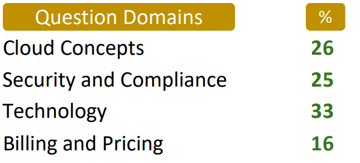
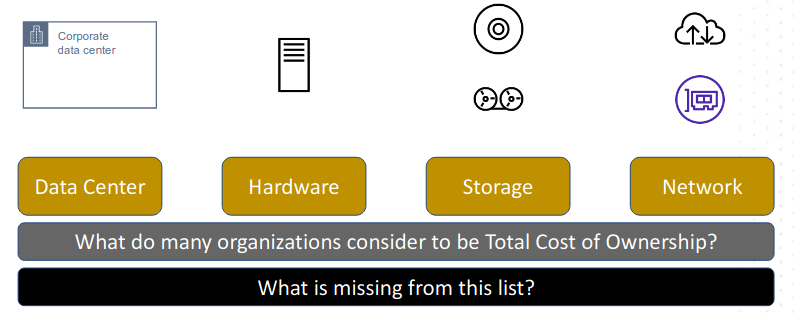
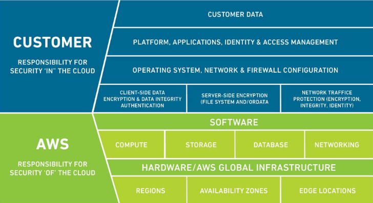
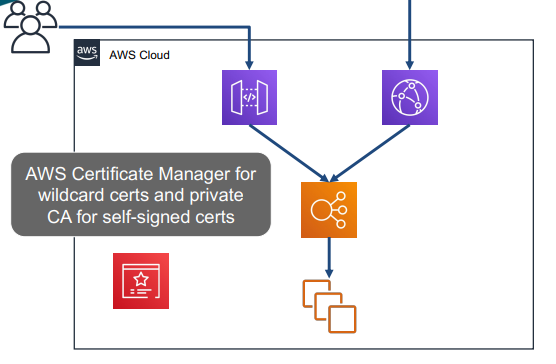
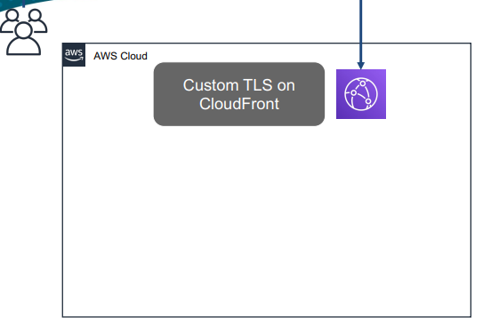

## Cloud Practitioner Exam Details


### What does the AWS Cloud Practitioner Certification Validate?

1. Candidate's ability to Explain the value of the AWS Cloud
2. Understand and explain the AWS shared responsibility model
3. Understand security best practices
4. Understand AWS Cloud costs, economics, and billing practices
5. Describe and position the core AWS services, including compute, network, databases, and storage
6. Identify AWS services for common use cases

### What is out of scope in AWS Cloud Practitioner Certification 

- Coding
- Designing cloud architecture
- Troubleshooting
- Implementation
- Migration
- Load and performance testing
- Business applications


### Question Domains


### Question Format

- All questions are fact-based. None of them will involve more than a single topic 
- Multiple response questions are clearly marked. (SELECT two or three)
- Question details are RELEVANT
- No mixing of question domains
- No trick questions

## Domain #1 - Cloud Concepts

### Domain Points
- Define the AWS Cloud and its value proposition
- Identify aspects of AWS Cloud economics
- Explain the different cloud architecture design principles

### AWS Official Definition
Amazon Web Services (AWS) is the world’s most comprehensive and broadly adopted **cloud** platform, offering over 200 fully featured services from data centers globally. Millions of customers—including the fastest-growing startups, largest enterprises, and leading government agencies—are using AWS to lower costs, become more agile, and innovate faster.

- Cloud
  - On-demand
  - Pay as you go
  - Network-accessible

### Cloud Value Proposition

- Security: AWS offters easy access to centralized securitu services and features
- Reliability: Reduced KTLO (keep the lights on) tasks because AWS manages the data centers
- High Availability: Placement options for business continuity, and built-in HA(High Availability)/FT(Fault Tolerence) for many services and features
- Elasticity: **Scale out** for performance, **scale in** for cost
- Agility: AWS democratizes advanced technologies making them easier to adopt
- Pay-as-you go pricing: Allow for experimentation and testing, even at full scale
- Scalability: Scale out to much greater capacity than would be possible on-premises
- Global Reach: Provision resources close to customers or to maintain compliance
- Economy of scale: AWS Pricing is competitive because of the overall size of infrastructure


``` 
Which of the following benefits of the cloud value proposition would be defined by the ability to add or remove resources to meet demand?


A. Reliability
B. Scalability
C. Elasticity
D. Economy of scale
```

```
Answer: C

Elasticity - the ability of a system to increase and decrease resources allocated (usually horizontally) to match demand, and implies automation.
```

### AWS Cloud economics

- Pay as You Go
  - Adapt to changing business needs
  - Stop wasting time on forecasting
  - No need to overprovision

- Save When You Commit
  - Reservations
  - Savings Plans
  - 1- or 3-year commitments

- Pay Less By Using More
  - Volume-based discounts
  - Tiered pricing
  - Mostly storage and network traffic

- CapEx
  - Up front payment
  - Maintenance contracts
  - Amortize value over time
  - Own the product
  - Predictable cost

- OpEx
  - Subscriptions
  - Pay as you go
  - Operations have their own cost
  - Variable and often unpredictable

#### TCO - Total Cost of Ownership

- **What is missing from this list?**
  - KTLO - Keeping THe Lights On
    - Any zero-sum game operation
    - Proportional to unmanaged resources
    - More OS-based resources = more operations

#### Cloud Software Licensing (???)
- More complex than on-premises licensing
- Must account for temporary resources
- Bring Your Own - sometimes

``` 
Which of the following is not part of AWS cloud economics?


A. Pay as you go
B. Save when you commit
C. Pay less by using more
D. Pay for everything up front
```

```
Answer: D

**The AWS pricing model does not support CapEx methods**, and is much more oriented toward dynamic, operational expenses.
```

### Cloud Architecture Design Principles

#### Design Principles
- Design for failure
- Decouple components
- Implement Elasticity

#### Well-Architected Framework


- **Operational Excellence**
  - The ability to **support development and run workloads effectively**, gain insight into their operations, and to continuously improve supporting processes and procedures to deliver business value.
  - **Perform operations as code**
  - Make frequent, small, reversible changes
  - Annotated documentation
  - Refine operations procedures frequently
  - Anticipate failure
  - Learn from all operational failures

- **Performance Efficiency**
  - The ability to **use computing resources efficiently to meet system requirements**, and to maintain that efficiency as demand changes and technologies evolve.
  - Democratize advanced technologies
  - Use serverless architectures
  - Go global in minutes
  - Experiment more often
  - Mechanical sympathy

- **Security**
  - The ability to **protect data, systems, and assets to take advantage of cloud technologies** to improve your security.
  - Implement a strong identity foundation
  - Apply security at all layers
  - Enable traceability
  - Automate security best practices
  - Protect data in transit and at rest
  - Keep people away from data
  - Prepare for security events

- **Reliability**
  - The ability of a **workload to perform its intended function correctly and consistently when it’s expected to**. This includes the ability to operate and test the workload through its total lifecycle.
  - Test recovery procedures
  - Scale horizontally to increase aggregate system availability
  - Automatically recover from failure
  - Stop guessing capacity
  - Manage change in automation

- **Cost Optimization**
  - The ability to **run systems to deliver business value at the lowest price point**.
  - Adopt a consumption model
  - Stop spending money on data center operations
  - Measure overall efficiency
  - Analyze and attribute expenditure
  - Use managed services to reduce cost of ownership

- **Sustainability**
  - Ability to **focus on environmental impacts, especially energy consumption and efficiency, since they are important levers for architects to inform direct action to reduce resource usage**.
  - Understand your impact
  - Maximize utilization
  - Establish sustainability goals
  - Anticipate and adopt new, more efficient hardware and software offerings
  - Use managed services
  - Reduce the downstream impact of your cloud workloads

```
Which of the pillars of the Well-Architected Framework
contains the principle "stop guessing capacity"?

A. Performance efficiency
B. Operational excellence
C. Reliability
D. Sustainability
```

```
**Answer: C**

The Reliability pillar has some overlap with Performance Efficiency, but the maximum capacity values belong in Reliability
```
## Domain #2 - Security and Compliance

### AWS Shared Responsibility Model
- “Security of the Cloud”: **Responsible for protecting the infrastructure** that runs all of the services offered in the AWS Cloud. This infrastructure is composed of the hardware, software, networking, and facilities that run AWS Cloud services.

### Customer Responsibility
- "Security in the Cloud”: Responsibility will be determined by the AWS Cloud services that a customer selects. This determines the amount of configuration work the customer must perform as part of their security responsibilities.

#### Specific Controls
Controls which are solely the responsibility of the customer based on the application they are deploying within AWS services.

- Region Choices
- Service/feature Choices

### Shared Responsibility Big Picture



```
Which of the following responsibilities would the customer manage directly, according to the AWS shared responsibility model? (pick two)

A. Applying security patches to the hypervisor for virtual machines
B. Enforcing DDoS protection for service API endpoints
C. User account management on virtual machine guest operating systems
D. Selecting the encryption key to use for protecting data at-rest
E. In-transit encryption of cross-region network traffic
```


```
Answer: C and D

All guest OS operations are the responsibility of the customer, as is the choice of encryption keys for any at- rest encryption
```

### Service Compliance Considerations
- Service availability doesn't imply all features are available in the region
- Check for service compliance by program (PCI, SOC, GDPR, etc.)
- Service compliance doesn't imply all features are compliant


### At-rest Encryption
Encryption at rest is when data at rest is given layers of encryption for security. 

### In-Transit Encryption On AWS


- The CloudFront distribution must have the DNS CNAME records listed in the configuration for TLS.

- The API Gateway must also have the DNS CNAME records listed in the configuration for TLS.
- Classic and Network load balancers support 1 TLS cert, Application load balancers support 25.
- This cert does not require matching DNS or can even be expired as the ELB does not validate TLS.
- ACM certs must be provisioned in us-east-1 for CloudFront, otherwise in the same region as the resource.

```
When a customer chooses server side data encryption in an AWS service, who owns the Data Encryption Key (DEK)?

A. A third party, usually the owner of the root CA
B. AWS only
C. The customer only
D. AWS or the customer, depending on the service
```

```
Answer: D

When choosing server side encryption in AWS, the customer can choose .to own the master encryption key and the DEK, or can delegate .ownership of those to AWS for some services.

```
### Auditing and Reporting - CloudWatch
- Region scope
- AWS resource monitoring service
- Collect and track metrics

#### CloudWatch Logs
- Region scope
- Fault tolerant
- Durable
- Push, not pull

### Auditing and Reporting - Config
- Region scope
- Config streams
- Capture changes and configuration
- Snapshots
- Rules

### Auditing and Reporting - CloudTrail
- Region scope
- Audit trail of AWS API actions in your account
- Log successes and failures
- Multi-region trailsupport
- Organization trail support
- Transferred to S3 for long-term storage
- Searchable history
- Insights event reporting

```
Who maintains responsibility for the retention of security audit logs in AWS?

A. AWS
B. The customer
C. Both AWS and the customer
D. Neither AWS or the customer
```

```
Answer: B

The customer is 100% responsible for enabling and retaining log features in AWS.

```

### Least Privilege - RBAC and ABAC
TODO